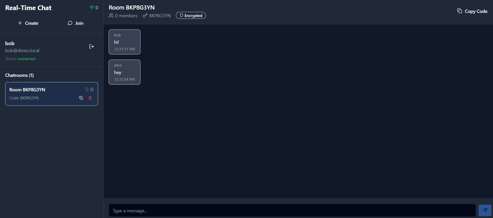

# Real-Time Chat Application

A modern, decentralized peer-to-peer chat application with end-to-end encryption, built with React and FastAPI.




## 🚀 Features

### Core Features
- **Real-time messaging** with WebSocket support
- **End-to-end encryption** for secure communications
- **Peer-to-peer chat** capabilities
- **User authentication** with JWT tokens
- **Dark/Light theme** support
- **Responsive design** for all devices

### Advanced Features
- **Multi-database architecture** (PostgreSQL, MongoDB, Redis)
- **File sharing** and media support
- **Message search** and indexing
- **Rate limiting** and security measures
- **AI-powered features** (OpenAI integration)
- **Real-time notifications**

## 🏗️ Architecture

### Frontend (React + Vite)
- **React 18** with modern hooks and context
- **Vite** for fast development and building
- **Tailwind CSS** for styling
- **React Router** for navigation
- **Lucide React** for icons

### Backend (FastAPI)
- **FastAPI** for REST API and WebSocket support
- **Multi-database setup**:
  - **PostgreSQL**: User accounts and metadata
  - **MongoDB**: Message storage and search
  - **Redis**: Caching and real-time features
- **JWT authentication** with bcrypt password hashing
- **WebSocket** for real-time communication

## 📋 Prerequisites

- **Node.js** 18+ and **npm**
- **Python** 3.8+
- **Docker** (optional, for easy database setup)
- **PostgreSQL**, **MongoDB**, and **Redis** (if not using Docker)

## 🚀 Quick Start

### 1. Clone the Repository
```bash
git clone https://github.com/nnn007/real-time-chat.git
cd Real-Time-Chat-App
```

### 2. Frontend Setup
```bash
# Install dependencies
npm install

# Start development server
npm run dev
```

The frontend will be available at `http://localhost:5173`

### 3. Backend Setup

#### Option A: Using Docker (Recommended)
```bash
cd backend

# Run the automated setup
python setup.py

# Start databases with Docker
docker-compose up -d postgres mongodb redis

# Initialize databases
python init_db.py

# Start the backend server
python start_server.py
```

#### Option B: Manual Setup
```bash
cd backend

# Install Python dependencies
pip install -r requirements.txt

# Copy and configure environment variables
cp env.example .env
# Edit .env with your database credentials

# Initialize databases
python init_db.py

# Start the server
python start_server.py
```

The backend API will be available at `http://localhost:8000`

## 🔧 Configuration

### Frontend Environment Variables
Create a `.env` file in the root directory:
```env
VITE_API_URL=http://localhost:8000
VITE_WS_URL=ws://localhost:8000/ws
```

### Backend Environment Variables
Copy `backend/env.example` to `backend/.env` and configure:
```env
# Application
APP_NAME=RealTime Chat App
DEBUG=true
ENVIRONMENT=development

# Security
SECRET_KEY=your-super-secret-key-change-this-in-production
ALGORITHM=HS256

# Database URLs
POSTGRES_HOST=localhost
POSTGRES_PORT=5432
POSTGRES_USER=chat_user
POSTGRES_PASSWORD=chat_password_dev
POSTGRES_DB=realtime_chat

MONGODB_URL=mongodb://localhost:27017/realtime_chat
REDIS_URL=redis://localhost:6379
```

## 📁 Project Structure

```
Real-Time-Chat-App/
├── src/                    # Frontend source code
│   ├── components/         # Reusable UI components
│   ├── contexts/          # React contexts (Auth, etc.)
│   ├── pages/             # Page components
│   ├── services/          # API services
│   └── utils/             # Utility functions
├── backend/               # FastAPI backend
│   ├── app/              # FastAPI application
│   ├── database/         # Database models and migrations
│   └── requirements.txt  # Python dependencies
├── docs/                 # Documentation
├── database/             # Database files
└── dist/                 # Build output
```

## 🛠️ Development

### Frontend Commands
```bash
npm run dev          # Start development server
npm run build        # Build for production
npm run preview      # Preview production build
npm run lint         # Run ESLint
```

### Backend Commands
```bash
cd backend
python start_server.py     # Start development server
python test_server.py      # Run tests
python init_db.py          # Initialize databases
```

## 🔒 Security Features

- **End-to-end encryption** for all messages
- **JWT token authentication**
- **Bcrypt password hashing**
- **Rate limiting** on API endpoints
- **CORS protection**
- **Input validation** with Pydantic
- **SQL injection protection**

## 🌐 API Documentation

Once the backend is running, visit:
- **Interactive API docs**: `http://localhost:8000/docs`
- **ReDoc documentation**: `http://localhost:8000/redoc`

## 🧪 Testing

### Frontend Testing
```bash
npm test
```

### Backend Testing
```bash
cd backend
python test_server.py
```

## 📦 Deployment

### Frontend Deployment
```bash
npm run build
# Deploy the dist/ folder to your hosting service
```

### Backend Deployment
```bash
cd backend
# Use Docker for production deployment
docker build -t chat-backend .
docker run -p 8000:8000 chat-backend
```

## 🤝 Contributing

1. Fork the repository
2. Create a feature branch (`git checkout -b feature/amazing-feature`)
3. Commit your changes (`git commit -m 'Add amazing feature'`)
4. Push to the branch (`git push origin feature/amazing-feature`)
5. Open a Pull Request

## 📄 License

This project is licensed under the MIT License - see the [LICENSE](LICENSE) file for details.

## 🆘 Support

If you encounter any issues:

1. Check the [backend README](backend/README.md) for detailed setup instructions
2. Review the [local setup guide](backend/LOCAL_SETUP.md)
3. Open an issue on GitHub

## 🙏 Acknowledgments

- Built with [React](https://reactjs.org/) and [FastAPI](https://fastapi.tiangolo.com/)
- Styled with [Tailwind CSS](https://tailwindcss.com/)
- Icons from [Lucide React](https://lucide.dev/)
- Database support with PostgreSQL, MongoDB, and Redis
